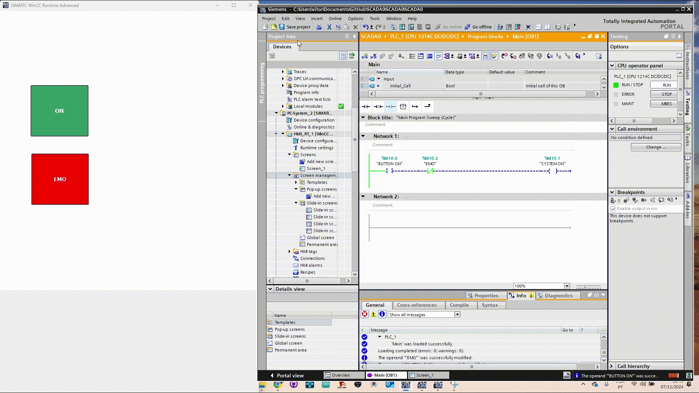

## [Assista ao vídeo da demonstração](https://github.com/Vitoria-Barbara/SCADA/blob/main/assets/SCADA%20demonstration.mp4)

# SCADA System in TIA Portal: Step-by-Step Guide  

### **Creating a Project**  

1. **Create a new project** in TIA Portal, selecting the specific PLC you plan to use.  
2. **Add a new device** with the specifications of your PLC.  

  

Once added, your screen should look like this:  

  

---

### **HMI Configuration**  

1. Open the **HMI_RT_1** section from the left-hand menu.  
2. Go to **Screens** and **add a new screen**.  

  

---

### **Editing the Screen**  

1. Create or edit a screen. In this example, we’ll add two simple buttons:  
   - One button for **System ON**.  
   - Another button for **System OFF**.  

  

2. **Customize the buttons**:  
   - Double-click the button to open its **Properties** menu.  
   - Go to the **Appearance** section.  
   - Change the **Fill Pattern** to a **Solid Color** and select the desired color.  

  
  
  

---

### **Adding Logic to the Buttons**  

1. Save your work frequently, as TIA Portal does not auto-save.  
2. Navigate to **PLC_1 -> Program Blocks -> MAIN**.  
3. Implement the logic required to handle the ON and OFF actions using ladder logic or your preferred programming method.  

  
  

---

### **Simulation**  

1. Save your project and **start a simulation test** using the simulator tool.  

  

---

### **Downloading to the Device**  

1. Click **Download to Device**.  
2. Configure the following settings:  
   - Uncheck any unnecessary options.  
   - Enable **PUT/GET communication** under the PLC communication settings.  

  
  
  

3. Confirm and load the configuration. Start the PLC module after loading.  

  

---

### **HMI Simulation**  

1. Click on the **HMI screen** and start the **Runtime simulation**.  

  

2. Verify or establish communication in the **HMI Connection** section.  

  
  

---

### **Advanced Configuration**  

1. If necessary, add a **communication module** (e.g., CP IE) for advanced setups.  
2. Reconfigure variables and readdress memory locations in the PLC if conflicts arise (e.g., Memory Clock issues).  

  

---
https://www.youtube.com/watch?v=96QfxMVIXyI
---

Your SCADA system is now successfully configured and ready to use!
